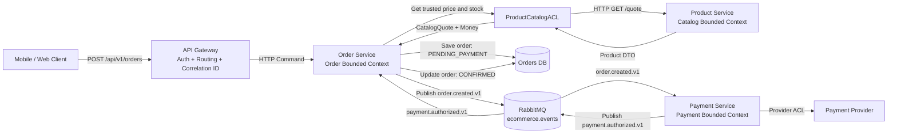

# ADR 0001: Service Folder Architecture

## Decision

Use `apps/<service>` as the canonical location for deployable service code.
The legacy import compatibility layer has been removed.

## Context

The project previously carried old compatibility imports during the folder
structure migration. Runtime commands, tests, and documentation now use the
canonical `apps.*` modules, so keeping compatibility aliases adds maintenance
cost without protecting an in-repo caller.

## Target Flow

This diagram captures the intended bounded-context flow for order placement and
payment authorization. It shows the translation layers explicitly:

The repository implementation does not yet expose every endpoint and event
named in this target flow. Use this as the DDD boundary reference, not as a
claim that the current runtime already matches every box and arrow.
